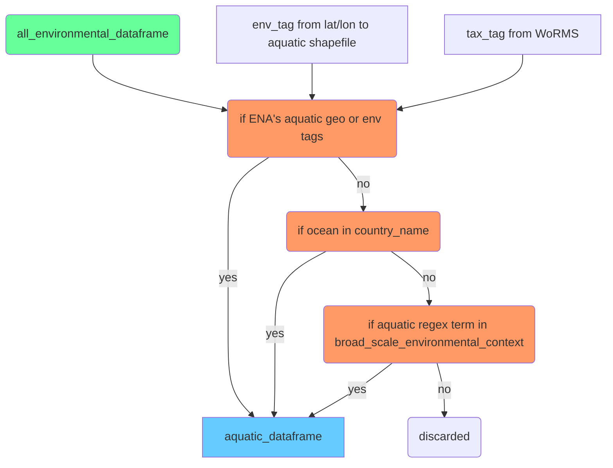

# Filtering of aquatic records for ENA environmental DNA

A course filtering for environmental DNA related samples was already done.

A series of tests were performed to determine whether the readrun records were associated with the aquatic environment. 

## Tags
The tax_tag’s for tax_marine, tax_brackish, tax_terrestrial and tax_freshwater are derived from the WoRMS environment assignments. 

The geo_tag’s for geo_marine, geo_brackish, geo_terrestrial and geo_freshwater are calculated if the longitude and latitude of the sample collection coordinates are within certain polygons in shapefiles. 
Aquatic is called where at least one of the tags is from an aquatic environment and the majority of tags are aquatic.

## Bias
There is bias towards finding marine rather than freshwater for three main reasons: 1) precision is needed for a lat/lon coordinate to be located in freshwater shapefiles, so challenging besides very large lakes or rivers 2) oceans and seas are often recorded in a country name metadata, other regions less so 3) WoRMS is focused on marine. The biome(broad_scale_environmental_context) field is particularly useful for freshwater though. 

Figure: Filtering the “environmental” records for those from an aquatic environment.

