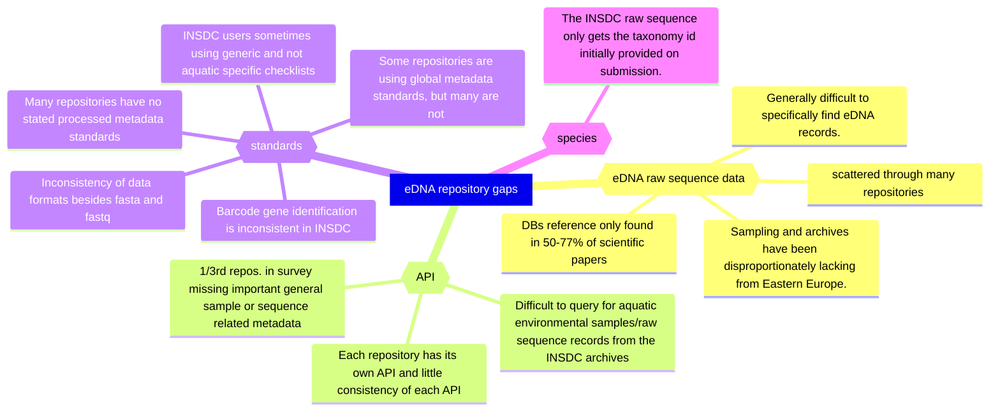

# Summary of GAPS found in T2.2

```mermaid
mindmap
  root[eDNA repository gaps]
    {{eDNA raw sequence data}}
    ::icon(fa-solid fa-dna)
      scattered through many repositories 
     DBs reference only found in 50-77% of scientific papers
     Sampling and archives have been disproportionately lacking from Eastern Europe.
     Generally difficult to specifically find eDNA records.
    {{API}}
    ::icon(fa fa-wrench)
        Each repository has its own API and little consistency of each API
        Difficult to query for aquatic environmental samples/raw sequence records from the INSDC archives
        1/3rd repos. in survey missing important general sample or sequence related metadata
    {{standards}}
    ::icon(fa-solid fa-language)
        Many repositories have no stated processed metadata standards
        Some repositories are using global metadata standards, but many are not 
        Inconsistency of data formats besides fasta and fastq
        Barcode gene identification is inconsistent in INSDC
        INSDC users sometimes using generic and not aquatic specific checklists
    {{species}}
    ::icon(fa-solid fa-fish)
        The INSDC raw sequence only gets the taxonomy id initially provided on submission.
```