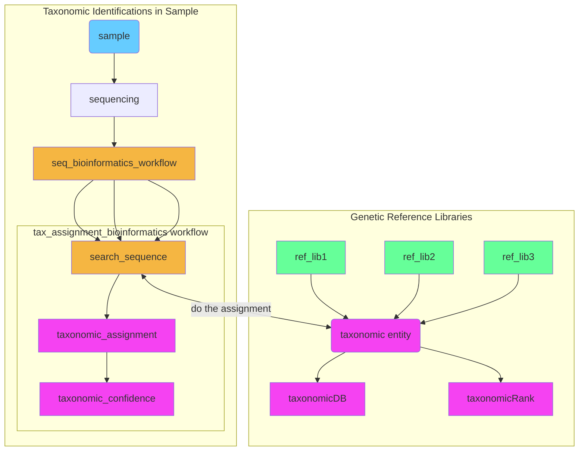

# Genetic Reference Libraries and Taxonomic Identification of Samples

eDNA needs to be identified. This is typically done via the genetic reference libraries by sequence similarity(e.g. blast), sequence composition(e.g. Bayes classifiers) or phylogeny

Figure: An example dataflow showing how eDNA taxonomy is identified

