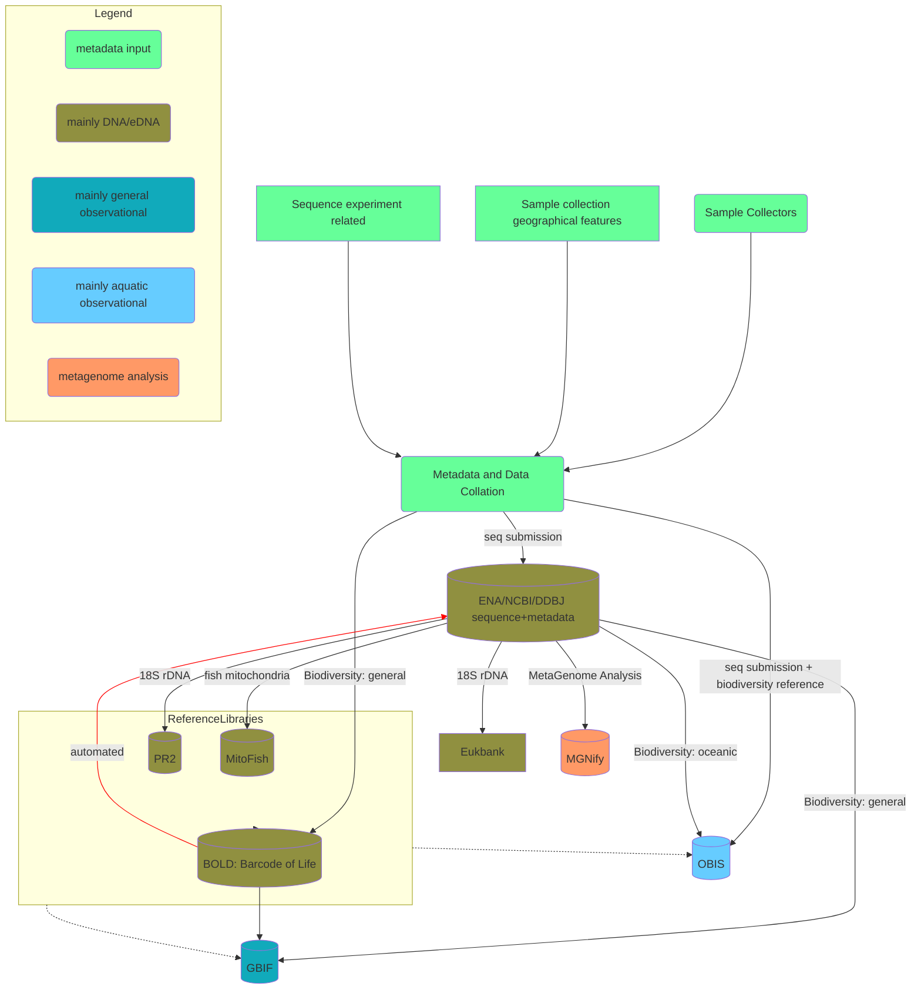

# Where aquatic environmental DNA archives fits

There is much overlap between resources in the eDNA space. Fortunately the eDNA archives are some of the least complex parts of this.

Figure: An example dataflow showing where the eDNA archives fit

